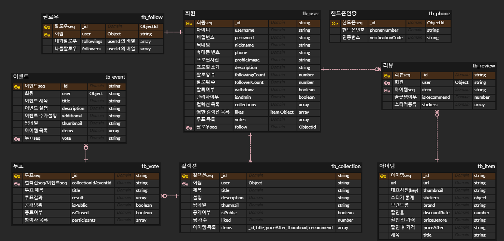

# Backend

## 👕ERD




## 🎈API 명세

|  번호  |  카테고리  |                    기능                    |                 URI                 |  PARAMS   |  METHOD  |
| :--: | :----: | :--------------------------------------: | :---------------------------------: | :-------: | :------: |
|  -   |   회원   |  <code>api/v1<mark>/auth</mark></code>   |                                     |           |          |
|  1   |        |                  회원 가입                   |        <code>/signup</code>         |           |  `POST`  |
|  2   |        |                  자체 로그인                  |         <code>/login</code>         |           |  `POST`  |
|  3   |        |                  토큰 재발급                  |        <code>/refresh</code>        |           |  `POST`  |
|  4   |        |                  회원 탈퇴                   |           <code>/</code>            |           | `DELETE` |
|  -   | 휴대폰 인증 |  <code>api/v1<mark>/phone</mark></code>  |                                     |           |          |
|  5   |        |               휴대폰 인증번호 발송                |           <code>/</code>            |           |  `POST`  |
|  6   |        |               휴대폰 인증번호 검증                |         <code>/check</code>         |           |  `POST`  |
|  -   |  프로필   | <code>api/v1<mark>/profile</mark></code> |                                     |           |          |
|  7   |        |                  프로필 조회                  |        <code>/:userId</code>        |           |  `GET`   |
|  8   |        |                  프로필 수정                  |           <code>/</code>            |           | `PATCH`  |
|  9   |        |                 비밀번호 변경                  |       <code>/password</code>        |           | `PATCH`  |
|  -   |  팔로잉   | <code>api/v1<mark>/follow</mark></code>  |                                     |           |          |
|  10  |        |                팔로우/팔로우 취소                |           <code>/</code>            |           |  `POST`  |
|  11  |        |                팔로잉 목록 조회                 |  <code>/:userId/followings</code>   |           |  `GET`   |
|  12  |        |                팔로워 목록 조회                 |   <code>/:userId/followers</code>   |           |  `GET`   |
|  -   |  컬렉션   | <code>api/v1<mark>/collection</mark></code> |                                     |           |          |
|  13  |        |                  컬렉션 생성                  |           <code>/</code>            |           |  `POST`  |
|  14  |        |                컬렉션 목록 조회                 |        <code>/:userId</code>        |           |  `GET`   |
|  15  |        |                컬렉션 상세 조회                 | <code>/:userId/:collectionId</code> |           |  `GET`   |
|  16  |        |                  컬렉션 수정                  | <code>/:userId/:collectionId</code> |           | `PATCH`  |
|  17  |        |                  컬렉션 삭제                  | <code>/:userId/:collectionId</code> |           | `DELETE` |
|  -   | 컬렉션 찜  |  <code>api/v1<mark>/like</mark></code>   |                                     |           |          |
|  18  |        |               컬렉션 찜 설정/해제                |           <code>/</code>            |           |  `POST`  |
|  19  |        |               컬렉션 찜 목록 조회                |           <code>/</code>            |           |  `GET`   |
|  -   |   투표   |  <code>api/v1<mark>/vote</mark></code>   |                                     |           |          |
|  20  |        |                  투표 생성                   |           <code>/</code>            |           |  `POST`  |
|  21  |        |                 투표 목록 조회                 |           <code>/</code>            | accountId |  `GET`   |
|  22  |        |                 투표 상세 조회                 |        <code>/:voteId</code>        | accountId |  `GET`   |
|  23  |        |                  투표 종료                   |        <code>/:voteId</code>        |           | `PATCH`  |
|  24  |        |                  투표 삭제                   |        <code>/:voteId</code>        |           | `DELETE` |
|  25  |        |                  투표권 행사                  |    <code>/:voteId/:itemId</code>    |           | `PATCH`  |
|  -   |   검색   | <code>api/v1<mark>/search</mark></code>  |                                     |           |          |
|  26  |        |               아이템, 컬렉션 검색                |           <code>/</code>            |   type    |  `POST`  |
|  -   |  아이템   |  <code>api/v1<mark>/item</mark></code>   |                                     |           |          |
|  27  |        |                  아이템 등록                  |           <code>/</code>            |           |  `POST`  |
|  28  |        |                아이템 상세 조회                 |        <code>/:itemId</code>        |  userId   |  `GET`   |
|  29  |        |                  아이템 추가                  |        <code>/:itemId</code>        |           | `PATCH`  |
|  -   | 아이템 리뷰 | <code>api/v1<mark>/item/:itemId</mark></code> |                                     |           |          |
|  30  |        |                  리뷰 생성                   |        <code>/review</code>         |           |  `POST`  |
|  31  |        |                  리뷰 수정                   |   <code>/review/:reviewId</code>    |           | `PATCH`  |
|  -   |   추천   | <code>api/v1<mark>/recommend</mark></code> |                                     |           |          |
|  32  |        |                  컬렉션 추천                  |        <code>/:userId</code>        |           |  `GET`   |
|  -   |  이벤트   |  <code>api/v1<mark>/event</mark></code>  |                                     |           |          |
|  33  |        |                  이벤트 생성                  |           <code>/</code>            |           |  `POST`  |
|  34  |        |                이벤트 목록 조회                 |           <code>/</code>            |           |  `GET`   |
|  35  |        |                이벤트 상세 조회                 |       <code>/:eventId</code>        |           |  `GET`   |
|  36  |        |                  이벤트 수정                  |       <code>/:eventId</code>        |           | `PATCH`  |
|  37  |        |                  이벤트 삭제                  |       <code>/:eventId</code>        |           | `DELETE` |


## 🎨CI/CD


## 🌱File structure

```reStructuredText
backend
├─src
│   ├─aws
│   |  └─index.js
│   ├─models
│   |  ├─Collection.js
│   |  ├─Event.js
│   |  ├─Follow.js
│   |  ├─Item.js
│   |  ├─Phone.js
│   |  ├─Review.js
│   |  ├─User.js
│   |  ├─Vote.js
│   |  └─index.js
│   ├─routes
│   |  ├─auth.js
│   |  ├─collection.js
│   |  ├─event.js
│   |  ├─follow.js
│   |  ├─index.js
│   |  ├─item.js
│   |  ├─like.js
│   |  ├─phone.js
│   |  ├─profile.js
│   |  ├─recommend.js
│   |  ├─review.js
│   |  ├─search.js
│   |  └─vote.js
│   └─sms
│      └─index.js
├─.dockerignore
├─Dockerfile
├─Dockerfile.dev
├─package-lock.json
├─package.json
└─server.js
```

